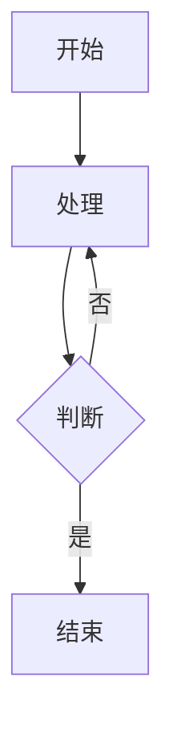

# Markhere 用户手册

## 目录

1. [简介](#简介)
2. [安装与启动](#安装与启动)
3. [基本编辑](#基本编辑)
4. [双向链接与知识图谱](#双向链接与知识图谱)
5. [AI助手](#ai助手)
6. [图片管理](#图片管理)
7. [插件系统](#插件系统)
8. [键盘快捷键](#键盘快捷键)
9. [导出功能](#导出功能)
10. [常见问题](#常见问题)

---

## 简介

Markhere 是一款现代化的跨平台所见即所得 Markdown 编辑器，专为现代作家、开发者和团队设计。基于 Tauri 2.5 和 React 19 构建，提供原生性能和 Web 灵活性，支持 macOS、Windows 和 Linux。

### 核心特性

- ✅ **实时所见即所得编辑** - 自然写作，即时格式化预览
- ✅ **智能 Markdown 转换** - 自动格式检测与转换
- ✅ **双向链接** - WikiLink 语法支持，知识图谱可视化
- ✅ **AI助手** - 12家国内AI供应商集成
- ✅ **插件系统** - 可扩展架构
- ✅ **多格式导出** - PDF、Word、HTML、EPUB
- ✅ **实时协作** - Y.js 驱动的同步功能

---

## 安装与启动

### 系统要求

| 平台 | 要求 |
|------|------|
| macOS | macOS 10.15+ (Catalina 或更高) |
| Windows | Windows 10/11 (64位) |
| Linux | Ubuntu 18.04+, Debian 10+, Fedora 30+ |

### 安装步骤

1. 从 [Releases](https://github.com/jacksoncode/Markhere/releases) 页面下载最新版本
2. macOS: 双击 `.dmg` 文件安装
3. Windows: 运行 `.exe` 安装程序
4. Linux: 
   - Debian/Ubuntu: `sudo dpkg -i markhere_x.x.x_amd64.deb`
   - 其他: 运行 `.AppImage` 文件

### 首次启动

启动后，Markhere 会显示欢迎界面，包含：
- 快速入门指南
- 文档模板选择
- 设置向导

---

## 基本编辑

### 文本格式化

| 操作 | 快捷键 | 说明 |
|------|--------|------|
| 加粗 | `Ctrl/Cmd + B` | **粗体文本** |
| 斜体 | `Ctrl/Cmd + I` | *斜体文本* |
| 下划线 | `Ctrl/Cmd + U` | <u>下划线文本</u> |
| 删除线 | `Ctrl/Cmd + Shift + X` | ~~删除线~~ |
| 代码 | `Ctrl/Cmd + E` | `inline code` |

### 段落格式

| 标题级别 | 快捷键 |
|----------|--------|
| 标题 1 | `Ctrl/Cmd + 1` |
| 标题 2 | `Ctrl/Cmd + 2` |
| 标题 3 | `Ctrl/Cmd + 3` |
| 标题 4-6 | `Ctrl/Cmd + 4-6` |

### 列表

- **无序列表**: 输入 `-` 或 `*` 后空格
- **有序列表**: 输入 `1.` 后空格
- **任务列表**: 输入 `- [ ]` 或 `- [x]`

### 表格

点击工具栏表格按钮或使用快捷键 `Ctrl/Cmd + T` 插入表格。

表格支持：
- 拖拽调整列宽
- 添加/删除行列
- 单元格合并
- 数据排序

### 代码块

输入 ```` 后跟语言名称（如 ````javascript`），支持 50+ 语言语法高亮。

```

```javascript
function hello() {
  console.log("Hello, Markhere!");
}
```

```

### 数学公式

使用 `$` 包裹行内公式，`$$` 包裹块级公式。

行内: `$E = mc^2$`

块级:
```
$$
\int_0^\infty e^{-x^2} dx = \frac{\sqrt{\pi}}{2}
$$
```

### Mermaid 图表

支持流程图、时序图、甘特图等：

```

```

---

## 双向链接与知识图谱

### WikiLink 语法

使用 `[[文件名]]` 创建双向链接：

```
[[项目计划]]
[[会议纪要|上周会议]]
```

语法说明：
- `[[目标]]` - 链接到"目标"文档，显示"目标"
- `[[目标|显示文本]]` - 链接到"目标"，显示"显示文本"

### 链接跳转

点击链接可以：
- 打开目标文档（新标签页）
- 查看链接统计（反向链接数量）
- 在知识图谱中定位

### 知识图谱

打开方式：`视图 > 知识图谱` 或快捷键 `Ctrl/Cmd + Shift + G`

功能：
- 📊 可视化所有文档链接关系
- 🔍 搜索节点快速定位
- 🖱️ 拖拽节点调整布局
- 📈 查看链接数量统计

图谱操作：
- 单击节点: 高亮相关链接
- 双击节点: 打开文档
- 悬停节点: 显示详情

---

## AI助手

### 供应商配置

支持 12 家国内 AI 供应商：

| 供应商 | 特点 |
|--------|------|
| DeepSeek | 代码能力强，性价比高 |
| 智谱AI (GLM) | 长文本支持，工具调用 |
| Moonshot (Kimi) | 128K 超长上下文 |
| 通义千问 | 多模态支持 |
| MiniMax | 语音合成特色 |
| 阶跃星辰 | 快速响应 |
| 讯飞星火 | 中文优化 |
| 百川智能 | 安全合规 |
| 硅基流动 | 多模型聚合 |
| 阿里云百炼 | 企业级方案 |
| 火山引擎 | 豆包系列 |
| 腾讯云 | 混元系列 |
| Ollama | 本地部署 |

### 配置步骤

1. 打开 `设置 > AI助手`
2. 选择供应商
3. 输入 API Key
4. 系统自动获取可用模型
5. 选择使用的模型

### AI功能

| 功能 | 快捷键 | 说明 |
|------|--------|------|
| 智能补全 | `Alt + Space` | 基于上下文补全文本 |
| 润色优化 | `Ctrl/Cmd + Alt + R` | 优化表达，消除冗余 |
| 翻译 | `Ctrl/Cmd + Alt + T` | 中英互译 |
| 摘要总结 | `Ctrl/Cmd + Alt + S` | 生成内容摘要 |
| 扩展内容 | `Ctrl/Cmd + Alt + E` | 扩展相关内容 |
| 自定义提示 | `Ctrl/Cmd + Alt + P` | 输入自定义指令 |

### 使用示例

**润色优化**:
- 选中一段文字
- 点击润色按钮或快捷键
- AI 返回优化建议
- 接受或拒绝修改

**智能补全**:
- 在光标位置触发
- AI 根据上下文预测
- Tab 接受，Esc 取消

---

## 图片管理

### 存储模式

三种图片保存模式：

#### 1. 本地目录
- 保存到指定的本地文件夹
- 适合固定工作环境
- 配置: 设置 > 图片 > 本地路径

#### 2. 相对路径
- 相对于文档位置保存
- 适合项目迁移
- 默认: `./images` 子文件夹

#### 3. 云端图床
- 上传到云存储服务
- 支持服务商：
  - 阿里云 OSS
  - 腾讯云 COS
  - AWS S3
  - Cloudflare R2
  - 自定义图床

### 云端配置

配置项：
- 存储桶名称 (Bucket)
- 访问密钥 ID (Access Key ID)
- 访问密钥 Secret (Access Key Secret)
- 区域 (Region)
- 自定义 URL (可选，用于 CDN)

### 图片操作

- 📥 **粘贴图片**: Ctrl+V 直接粘贴
- 📁 **拖拽上传**: 拖拽图片到编辑器
- 🔗 **链接插入**: 输入图片 URL
- 🖼️ **调整大小**: 拖拽图片边角
- ✂️ **裁剪**: 右键菜单裁剪

---

## 插件系统

### 插件结构

插件目录结构：
```
my-plugin/
├── manifest.json    # 插件元数据
├── main.js          # 插件代码
├── icon.png         # 插件图标
└── assets/          # 资源文件
```

### manifest.json

```json
{
  "id": "com.example.my-plugin",
  "name": "我的插件",
  "version": "1.0.0",
  "author": "作者名",
  "description": "插件描述",
  "license": "MIT",
  "minAppVersion": "0.4.0"
}
```

### 插件API

可用接口：
- `registerCommand()` - 注册命令
- `registerExtension()` - 注册扩展
- `registerPanel()` - 注册面板
- `getEditor()` - 获取编辑器实例
- `getActiveFile()` - 获取当前文件
- `saveFile()` - 保存文件
- `showNotification()` - 显示通知

### 示例插件

```javascript
module.exports = {
  onLoad: async (api) => {
    api.registerCommand({
      id: 'myPlugin.hello',
      label: 'Hello World',
      category: 'plugin',
      handler: () => {
        api.showNotification('Hello!', 'info');
      },
    });
  },
};
```

### 安装插件

方式：
1. 从插件市场安装
2. 从本地路径安装
3. 手动放置到插件目录

管理：
- `设置 > 插件管理`
- 启用/禁用/移除插件

---

## 键盘快捷键

### 文件操作

| 快捷键 | 操作 |
|--------|------|
| `Ctrl/Cmd + N` | 新建文档 |
| `Ctrl/Cmd + O` | 打开文件 |
| `Ctrl/Cmd + S` | 保存 |
| `Ctrl/Cmd + Shift + S` | 另存为 |
| `Ctrl/Cmd + W` | 关闭标签页 |
| `Ctrl/Cmd + Shift + T` | 恢复关闭的标签页 |

### 编辑操作

| 快捷键 | 操作 |
|--------|------|
| `Ctrl/Cmd + Z` | 撤销 |
| `Ctrl/Cmd + Shift + Z` | 重做 |
| `Ctrl/Cmd + C` | 复制 |
| `Ctrl/Cmd + V` | 粘贴 |
| `Ctrl/Cmd + X` | 剪切 |
| `Ctrl/Cmd + F` | 查找 |
| `Ctrl/Cmd + H` | 替换 |

### 视图控制

| 快捷键 | 操作 |
|--------|------|
| `Ctrl/Cmd + K` | 命令面板 |
| `Ctrl/Cmd + Shift + F` | 专注模式 |
| `Ctrl/Cmd + Shift + T` | 打字机模式 |
| `Ctrl/Cmd + /` | 源码模式 |
| `Ctrl/Cmd + Shift + G` | 知识图谱 |
| `Ctrl/Cmd + B` | 切换侧边栏 |
| `Ctrl/Cmd + P` | 快速打开文件 |

### AI助手

| 快捷键 | 操作 |
|--------|------|
| `Alt + Space` | 智能补全 |
| `Ctrl/Cmd + Alt + R` | 润色优化 |
| `Ctrl/Cmd + Alt + T` | 翻译 |
| `Ctrl/Cmd + Alt + S` | 摘要总结 |

---

## 导出功能

### 支持格式

| 格式 | 用途 |
|------|------|
| PDF | 打印、分享 |
| Word (DOCX) | Office 协作 |
| HTML | 网页发布 |
| EPUB | 电子书 |
| Markdown (.md) | 版本控制 |

### 导出步骤

1. 点击 `文件 > 导出`
2. 选择导出格式
3. 配置导出选项：
   - 页面大小 (PDF)
   - 样式模板
   - 图片处理方式
4. 选择保存位置
5. 点击导出

### PDF 选项

- 页面大小: A4、Letter、自定义
- 边距设置
- 页码显示
- 目录生成
- 主题样式

---

## 常见问题

### Q: 如何切换语言？

A: `设置 > 通用 > 语言`，选择中文或英文。

### Q: 图片上传失败怎么办？

A: 
1. 检查云端配置是否正确
2. 验证 API Key 权限
3. 确认存储桶存在且有写入权限
4. 检查网络连接

### Q: 大文件打开很慢？

A: Markhere 会自动分块加载大文件，滚动时动态加载内容。如果仍然很慢，可以：
1. 关闭实时预览
2. 使用源码模式编辑
3. 分割文件为多个小文件

### Q: 如何恢复误删内容？

A:
1. `Ctrl/Cmd + Z` 撤销删除
2. 查看版本历史: `文件 > 版本历史`
3. 检查自动保存草稿: `文件 > 恢复草稿`

### Q: AI助手没有响应？

A:
1. 检查 API Key 是否正确
2. 确认网络连接正常
3. 查看模型是否支持该功能
4. 检查账户余额

### Q: 如何创建模板？

A:
1. 新建文档
2. 编辑模板内容
3. `文件 > 保存为模板`
4. 选择模板分类

### Q: 插件加载失败？

A:
1. 检查 manifest.json 格式
2. 确认 minAppVersion 符合要求
3. 查看控制台错误日志
4. 尝试重新安装插件

---

## 获取帮助

- **GitHub Issues**: [提交问题](https://github.com/jacksoncode/Markhere/issues)
- **社区讨论**: [GitHub Discussions](https://github.com/jacksoncode/Markhere/discussions)
- **更新日志**: 查看 RELEASE_NOTES.md

---

**感谢使用 Markhere!** ✨